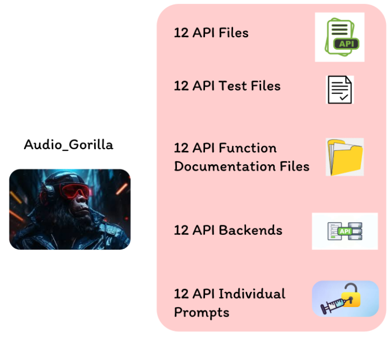

# Audio_Gorilla


**Audio_Gorilla** is a multistep, multiturn dataset for fine-tuning LLMs on **voice-driven API function calling**. It bridges the gap between conversational speech transcriptions and executable API sequences. The repository also includes an audio generation pipeline for producing speech samples and a vendored copy of the VibeVoice TTS model for voice cloning and humanization research.

---

## Core Components

* **16 Mock APIs**: Realistic schemas for Amazon, Spotify, YouTube, Gmail, Google Drive, Google Calendar, Simple Note, Smart Things, Tesla Fleet, X, Venmo, CommuniLink, Netflix, Slack, Smart Home, and Walmart Marketplace.
* **Stateful Backends**: Persistent JSON environments populated with synthetic data to support realistic queries and state changes.
* **Testing Framework**: Comprehensive unit tests for every API, plus realistic integration tests for Calendar, Drive, and auth flows.
* **Audio Pipeline**: Text-to-speech generation with background audio overlay using ElevenLabs or Hume.ai (falls back to Google TTS).
* **VibeVoice TTS**: Vendored community fork of the VibeVoice long-form multi-speaker TTS model, with fine-tuning support and voice cloning notebooks.

---

## Dataset Features

* **Speech-to-Function**: Focuses on extracting intent and parameters from natural, vague, or conversational transcriptions.
* **Multistep Tool-Use**: Trains models to orchestrate sequences across different services (e.g., Calendar + Gmail, Venmo + Spotify).
* **Contextual Awareness**: Supports multiturn dialogue where subsequent commands rely on previous turn history.
* **Cross-API Combinations**: Prompt files in `Prompts/Combinations/` cover multi-service scenarios (e.g., Gmail + Amazon, YouTube + X).

---

## Data Structure

Prompt data lives in `Prompts/` — one JSON file per API plus combination files.

| Field | Description | Example |
| :--- | :--- | :--- |
| **prompt** | Transcribed user instruction | "Email Dominic about the project status." |
| **tools** | Available API definitions | `["GmailApis"]` |
| **context** | User IDs or session state | `{"gmail_user": "73e6974e..."}` |
| **ground_truth** | Executable API call | `sendEmail(to='Dominic', subject='...', ...)` |

The full legacy dataset is in `Prompts/Prompt.JSON`. Per-API definition schemas are in `Prompts/definitions/`.

---

## Repository Map

```
.
├── *Apis.py                    # 16 mock API implementations (root level)
├── state_loader.py             # Utility to load stateful backend JSON into an API
│
├── Backends/                   # Synthetic state files and backend generation scripts
│   ├── diverse_*_state.json    # Pre-generated diverse state for each API
│   └── create*Backend.py       # Scripts to regenerate backend state
│
├── Prompts/                    # Fine-tuning dataset and API definitions
│   ├── *.json                  # Per-API prompt files
│   ├── Combinations/           # Multi-API cross-service prompt files
│   ├── definitions/            # Full API schema definitions (for prompt generation)
│   ├── MakeAICreatePrompts.py  # Script to generate prompts via LLM
│   └── checker.py              # Ground-truth validation checker
│
├── UnitTests/                  # Unit and integration tests for all APIs
│
├── AudioPipeline/              # TTS generation with background audio overlay
│   ├── voice_pipeline.py       # Main pipeline entry point
│   ├── voice_providers.py      # ElevenLabs / Hume.ai / gTTS adapters
│   ├── background_processor.py # Background audio mixing
│   ├── background/             # Ambient audio tracks (WAV)
│   └── README.md               # AudioPipeline usage docs
│
├── AudioScripts/               # Script to batch-generate audio from prompt files
│   └── generate_audio.py
│
├── demo_outputs/               # Sample MP3 files generated by the AudioPipeline
│
├── VibeVoice/                  # Vendored VibeVoice long-form TTS model (community fork)
│   ├── vibevoice/              # Model source: modular, processor, schedule, finetune
│   ├── demo/                   # Gradio demo and inference scripts
│   └── README.md               # VibeVoice model docs and quickstart
│
├── *.ipynb                     # Research notebooks:
│   ├── LibriTTSR_VoiceCloning.ipynb
│   ├── Voice_Humanization.ipynb
│   ├── Humanization_BigVGAN.ipynb
│   ├── Humanization_StyleTTS2.ipynb
│   ├── Humanization_Hybrid.ipynb
│   ├── Humanization_VoiceConversion.ipynb
│   └── Failed_cloning.ipynb
│
└── requirements.txt            # Python dependencies for AudioPipeline
```

---

## Audio Pipeline Quick Start

```bash
pip install -r requirements.txt

# Generate speech audio from a JSON prompt list
python -m AudioPipeline.voice_pipeline AudioPipeline/sample_prompts.json

# Optional env vars for paid voice providers
export ELEVENLABS_API_KEY=...
export HUME_API_KEY=...
export HUME_SECRET_KEY=...
```

See `AudioPipeline/README.md` for full usage details.

---

## VibeVoice

The `VibeVoice/` directory contains a community-maintained fork of Microsoft's VibeVoice — a frontier long-form multi-speaker TTS model capable of generating up to 90 minutes of audio with up to 4 speakers. Model weights are available on [Hugging Face](https://huggingface.co/vibevoice). See `VibeVoice/README.md` for setup and `VibeVoice/FINETUNING.md` for fine-tuning instructions.
